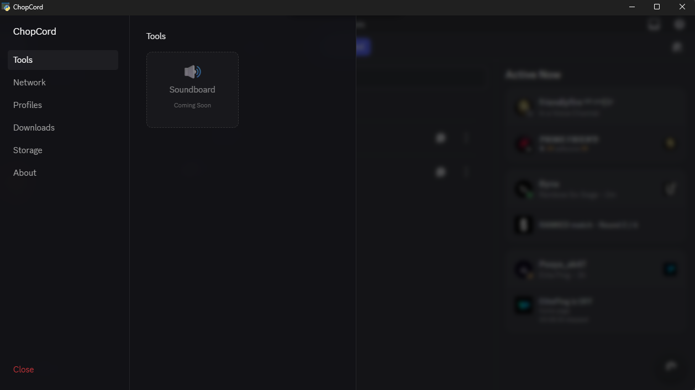
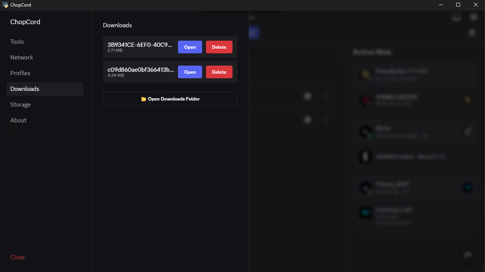
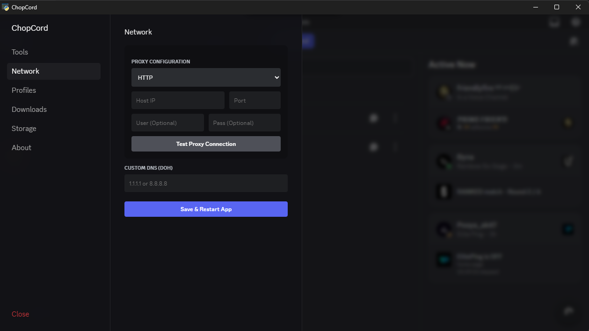

<h1 align="center">Chopcord</h1>
<h3 align="center">A Lightweight, Secure, Multi‑User Discord Client --- powered byPyWebview</h3>

<a href="#download"><b>Download</b></a> •
<a href="#features"><b>Features</b></a> •
<a href="#screenshots"><b>Screenshots</b></a> •
<a href="#roadmap"><b>Roadmap</b></a> •
<a href="#donate"><b>Donate</b></a>

------------------------------------------------------------------------

## 📚 About Chopcord

Chopcord is a modern **PyWebview-based desktop client for Discord**
built for users who want:

-   **More privacy**
-   **Less resource usage**
-   **Multiple Discord accounts with fast switching**
-   **Better control over downloads**
-   **Future tools like soundboard and utilities**

The goal is simple:
✨ **Make Discord lighter, more private, and more flexible --- without
changing how Discord works.**

------------------------------------------------------------------------

## ⭐ Features

### 🔒 Privacy & Security

-   Custom **proxy** support (HTTP/SOCKS)
-   Custom **DNS** support
-   Local-only execution --- **no servers, no data collection**

### 🧊 Lightweight Discord Experience

-   Built with **PyWebview**
-   Lower RAM usage
-   No extra background processes

### 👥 Multi-Account System

-   Create multiple Discord profiles
-   **Instant fast switching** between accounts
-   Isolation between user containers

### 📥 Download Manager

-   Tracks and organizes all your Discord downloads
-   Clean history view

### 🧰 Tools Section *(coming soon)*

-   Soundboard
-   Audio tools
-   Helper utilities
-   More tools based on community requests

------------------------------------------------------------------------

## 📸 Screenshots

 <em>Main Interface</em>  
 <em>Download Manager</em>  
 <em>Network Settings</em>

------------------------------------------------------------------------

## 📍 Why Trust Chopcord?

Chopcord is **fully open-source**, meaning:

-   🔍 You can inspect all code
-   🧱 No telemetry
-   🔐 No data collection
-   💻 Discord authentication happens directly with Discord
-   📦 Everything runs locally

### ⚠️ About Unsigned Builds

Chopcord is currently **not signed** due to the high cost of
certificates.
Windows may show an "unknown publisher" warning --- this is normal for
free/open-source projects.

You can verify safety by: - Building from source
- Checking commit history
- Validating release hashes

------------------------------------------------------------------------

## 📥 Download

### 🔧 Easy Method

1.  Visit the **Downloads** page
2.  Get the latest build for your OS
3.  Run it normally (you may ignore unsigned warning)

### 🛠️ Build From Source

    git clone https://github.com/YOUR_USERNAME/chopcord
    cd chopcord
    pip install -r requirements.txt
    python main.py

------------------------------------------------------------------------

## 🛣️ Roadmap

### ✅ Already Implemented

-   Discord in PyWebview
-   Multi‑user account switcher
-   Download manager
-   Proxy support
-   DNS customization
-   Modern UI improvements

### 🔜 Future Ideas

-   add new tools

------------------------------------------------------------------------

## ❤️ Support & Donate

Chopcord is developed independently and completely free.
If you want to support development, server costs, and help with **app
signing fees**, you can donate here:

Every contribution helps keep the project alive and improving 💙

------------------------------------------------------------------------

## 🤝 Contributing

Pull requests and ideas are welcome!

1.  Fork the repo
2.  Make a branch
3.  Submit a PR

------------------------------------------------------------------------

## 📜 License

MIT License
Free to use, modify, and distribute.

------------------------------------------------------------------------

## 🧱 Disclaimer

Chopcord is **not affiliated with Discord or Discord Inc.**
This project uses Discord's web version inside a PyWebview container.

------------------------------------------------------------------------

<b>Thank you for supporting Chopcord!</b>

